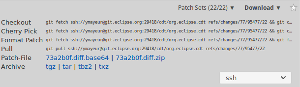

# WEEK FOUR: Get Started With Gerrit on CDT

You are probaly familiar with the pull request system of **GitHub** that
programmers use to contribute to an open-source project. **Gerrit** (named after
its designer Gerrit Rietveld) is basically an improved version of this system.
Gerrit allows the committer to give more precise feedback on each line of code
edited, and allows other members of the team to review those changes. Gerrit is
used by the CDT community. In this blog post I will show you how to efficiently
get started with it.

## The required tools & knowledge

Having Git is basically all you need to clone the sources, and push them. If
you want to edit them in a good environment use the [Eclipse JAVA
IDE](https://eclipse.org/downloads/packages/release/Neon/3). Knowing the basics
of Git is also required, though I think you could pick up Git as you go along
with a bit of trial and error.

## How to get the sources of CDT

Cloning the sources to your computer is an easy but essential task.

The link of the repository is:
git://git.eclipse.org/gitroot/cdt/org.eclipse.cdt

To clone use the following command: `git clone
git://git.eclipse.org/gitroot/cdt/org.eclipse.cdt`

Once you have the files, go to [Bugzilla](https://bugs.eclipse.org/bugs/) and
find a bug you want to fix.

## Pushing the changes to Gerrit

Now comes the tricky part. In order for you to be able to push your change a
few things have to be respected.
* You can only make one commit per change
* You have to sign off your commit using: `git commit -s`
* You must sign the [ECA](https://www.eclipse.org/legal/ECA.php) with the same
  email adress you use for Git
* Your commit must have a Change-ID. In order for your commit to automatically
  add a Change-ID you can install a hook. To install a hook go into the root
directory of the project and execute the following command:   `curl
-Lo.git/hooks/commit-msg http://review.example.com/tools/hooks/commit-msg`
* Add the Gerrit remote, by using one of the following links:
  http://git.eclipse.org:29418/cdt/org.eclipse.cdt.git or
ssh://commiterId@git.eclipse.org:29418/cdt/org.eclipse.cdt.git if you are using
SSH. Add the remote with the following command: `git remote add linkOfRepo`

When all this is done you can push them with: `git push gerrit
HEAD:refs/for/master`.

An Eclipse commiter will go through your changes and review them. You will be
notified by email once this review is done. If the change is accepted, well
done! If not, you will have to make any requested changes before pushing again
but you will need to keep the exact same Change-ID.

## Collaborative work

Working in collaboration with someone on Git ain't the easiest thing! So here
are some tips and tricks I would have liked to know before I got started. 

* If you are working with someone on the same Gitter change, you can add this
  to your commit message, so both of you get credit:  `also-by name
<email>`.

* To get what your collaborator has pushed to Gerrit whilst also retaining your
  changes you can use Cherry Pick.

  

  It may happen that conflicts arise - you can manually merge the confilicted
files and continue the Cherry Pick with:  `git cherry-pick --continue`.  
Merge yours and your colleague's commit by squashing the commits with: `git
rebase -i HEAD~2` and changing `pick` to `squash` on the second commit.

* When you are working on an open-source project within an active community
  such as Eclipse CDT, commits happen quite
frequently. If you want your change to be on the lastest version of the project
you may have to rebase it. Here's how to do it:
  * Checkout master
  * Pull the changes
  * Get back to your branch and do: `git rebase master`

## Conclusion

Gerrit is an improved pull-request system but the improvement comes with a
harder "getting-started" phase. You indeed have to work a bit harder to push
your first change to Gerrit, install a hook, understand how to work with a
collaborator, etc. But in the end the positive aspects outweigh the negative:
the very useful chain of feedback, and the fact that you don't have to fork the
project make it better for big projects like CDT. Good Luck!
