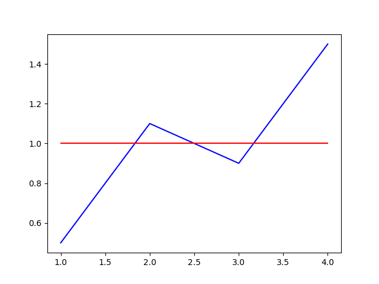

# WEEK SIX

## What I did

This week I got reintroduced to JUnit, having forgotten most of what I learned
about it at the University Institute of Technology. Junit is a unit testing
framework, it is used to test the different methods of a program to see
whether or not the intended behaviour is working. It is often said that a method
that is not tested is a method with bugs, and after a week of testing, I can
confirm that this is grounded in truth.

My job this week was to improve the test coverage of Eclipse January. You can
calculate the coverage of a program using the EclEmma plug-in. I worked on the
DatasetUtils class, improving the coverage from 47% to almost 58%, and fixing
bugs in two methods: (https://github.com/eclipse/january/pull/178 and
https://github.com/eclipse/january/pull/188).

Discovering that bugs can exist in untested code written by coders more
experienced than me, really showed me the importance of testing.

## How I did it

This is a test I have written for the method `crossings()`, writing this test
helped me highlight some unexpected behaviour in the way it works.
```java
@Test
public void testCrossings3() {
	Dataset yAxis = DatasetFactory.createFromObject(new Double[] {
			0.5, 1.1, 0.9, 1.5 });
	Dataset xAxis = DatasetFactory.createFromObject(new Double[] {
			1.0, 2.0, 3.0, 4.0 });
	List<Double> expected = new ArrayList<Double>();
	expected.add(2.5);
	List<Double> actual = DatasetUtils.crossings(xAxis, yAxis, 1,
			0.5);
	assertEquals(expected, actual);
}
```
This shows what the values look like:


The expected behaviour of the method as written in the test would be that the 3
crossing points would be merged into one at 2.5, but this wasn't what was
happening, indeed the code was using ">" instead of ">=". If not tested this
bug would probably never have been discovered.

Discovering bugs such as this one is crucial, indeed when people use this
method they are probably expecting the same behaviour I expected and will not
understand why their code isn't working, expecially if they can't see the
original code of the method and only have access to its Javadoc. I hope
correcting bugs such as this one will makes the experience other people have
using your product better by avoiding the extra hassle of getting used to some
unexpected behaviours.
